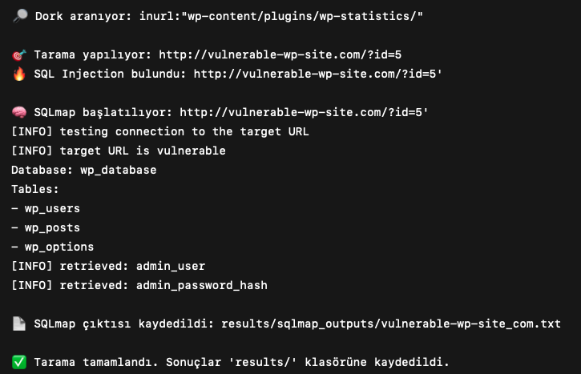

<p align="center">
  
</p>

# WordPress Plugin SQL Injection Scanner 🚀


Bu proje, Google Dorklar kullanarak WordPress eklentileri üzerinden siteleri bulur,  
SQL Injection (SQLi) zaafiyetlerini test eder, başarılı olursa **otomatik olarak sqlmap başlatıp veritabanı bilgisini çeker**  
ve tüm verileri **düzenli bir şekilde kayıt eder.**

---

## 📚 İçindekiler

- [Özellikler](#-özellikler)
- [Kurulum](#-kurulum)
- [Kullanım](#-kullanım)
- [Notlar](#-notlar)
- [Lisans](#-lisans)
- [Lisans](#-screenshot)
- [Yasal Uyarı](#-yasal-uyarı)

---

## 🎯 Özellikler

- 🔎 **Google Dorklar ile Site Bulma** (plugin bazlı odaklı arama)
- 🔥 **SQL Injection Payloadlarıyla Test Etme**
- 🛡️ **Proxy Desteği** (isteğe bağlı açık/kapalı)
- 🚀 **Multi-threaded** Çoklu site tarama (hızlı)
- 📂 **Denenmiş Siteleri Kaydetme ve Atlamak**
- 🧠 **Başarılı SQL Injection Sonrası Otomatik `sqlmap` ile DB Dump**
- 📄 **Dump edilen verileri otomatik dosyaya kaydetme**

---

## 🛠️ Kurulum

1. Python bağımlılıklarını yükleyin:

```bash
pip install requests googlesearch-python
```
---
## 🚀 Kullanım

Ana scripti çalıştırın:
python scanner.py

---

## ⚡ Notlar

* Script multi-thread çalışır ve aynı anda birçok siteyi hızlıca tarar.
* Proxy kullanımı isteğe bağlıdır. (Başlangıçta seçenek sunulur.)
* sqlmap otomatik çalıştırılırken:
* --batch ➔ Tüm sorulara otomatik evet denir.
* --dump ➔ Veritabanı tabloları ve içerikleri çekilir.
* Çıktılar organize şekilde results/ klasöründe tutulur.
* Proje Python 3.8+ sürümleriyle uyumludur.

---
## 📜 Lisans
Bu proje MIT Lisansı altında lisanslanmıştır.

MIT Lisansı, size özgürce kullanma, değiştirme ve dağıtma hakkı verir; ancak herhangi bir garanti vermez.

---
## 📷 Screenshot
Aşağıda WordPress SQL Injection tarayıcısının başarılı bir örnek çıktısını görebilirsiniz:


## ⚖️ Yasal Uyarı
✍️ Bu proje yalnızca eğitim ve araştırma amaçlıdır.
Bu script yalnızca izinli sistemler üzerinde kullanılmalıdır.
İzinsiz kullanım, yürürlükteki yasaları ihlal edebilir ve cezai sorumluluk doğurabilir.
Kullanıcı, bu scripti kullanırken doğabilecek tüm yasal sonuçlardan kendi sorumludur.
---